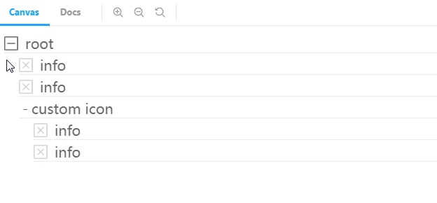

[](https://npmcharts.com/compare/react-spring-tree?minimal=true)
[](https://npmcharts.com/compare/react-spring-tree?minimal=true)
[](https://travis-ci.org/baobobbob/react-spring-tree)
[](https://coveralls.io/github/baobobbob/react-spring-tree?branch=master)

# React Spring Tree

## Example

[https://baobobbob.github.io/react-spring-tree/](https://baobobbob.github.io/react-spring-tree/)

## Install react-spring-tree

````shell script
npm install react-spring-tree --save
````

## How to use ?

```tsx
import React, { useState } from 'react'
import { SpringTreeNode } from 'react-spring-tree'

export const Demo = () => {
  const [open, setOpen] = useState(true)
  const [open1, setOpen1] = useState(false)
  return (
    <div>
      <SpringTreeNode open={open} onClickToggle={() => setOpen(!open)} name={'root'}>
        <SpringTreeNode name={'info'} />
        <SpringTreeNode name={'info'} />

        <SpringTreeNode
          toggleIcon={
            <div style={{ cursor: 'pointer', width: 18, textAlign: 'center' }}>
              {open1 ? '-' : '+'}
            </div>
          }
          open={open1}
          onClickToggle={() => setOpen1(!open1)}
          name={'custom icon'}
        >
          <SpringTreeNode name={'info'} />
          <SpringTreeNode name={'info'} />
        </SpringTreeNode>
      </SpringTreeNode>
    </div>
  )
}
```



